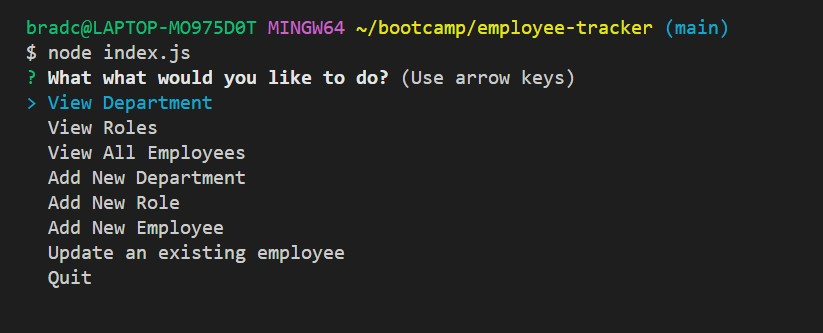
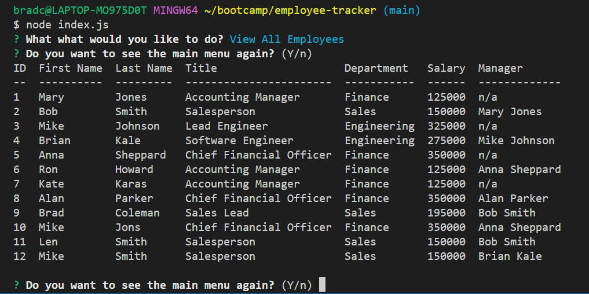

# employee-tracker

# **Table of Contents**
1. [Description](#description)
2. [Testing](#testing)
3. [Technology Used and Credits](#technology-used-and-credits)
4. [About the Author](#about-the-author)
5. [License](#license)


# **Description**

The goal of this project was to create a command line application to show and update an employee contact system. When launched the user is presented with a main menu to either view one of three reports (view departments, view roles or view employees) or to perform one of 4 actions (add new department, add new role, add a new employee or update an employee's role). This application is connected to a MySQL database using the NPM MySql2 package.  

Below is a screen shot of the main menu,



Below is a screen shot of the employee table that shows role, department, salary and manager.  The SQL query that generates this table is shown in the code high lights below.  




Link to Demonstration Video of how this Generator Works:

https://app.vidcast.io/share/c5b7ad80-6625-47ba-a1c6-4dcca6114933


# **Highlighted Code Example**

The following is code that I created that I would like to highlight.  

In this first block I created an object of the list that I pass to the NPM Inquirer Prompt to populate the list of views or actions the user can select from. I did this in order to also have access to the associated object key that represents the function that is used to handle the respective request.  Additionally, I would highlight that I used the eval method in order to use a variable to invoke a function. 

```
//Object that contains the main menu
const choiceObject = {
  viewDepartments: "View Department",
  viewRole: "View Roles",
  showEmployees: "View All Employees",
  addDepartmentQuest: "Add New Department",
  addRoleQuest: "Add New Role",
  addNewEmployeeQuest: "Add New Employee",
  updateEmployeeQuest: "Update an existing employee",
  // separator: new inquirer.Separator(),
  quit: "Quit",
  // separator1: new inquirer.Separator(),
};
const questions = [
  {
    type: "list",
    name: "view",
    message: "What what would you like to do?",
    pageSize: 10,
    choices: Object.values(choiceObject),
  },
];

/* This function displays the main menu that the user can select from.  Depending on the answer selected 
this function either invokes the execute Query function and passes the name of the sql query to return a 
report to the console log or invokes on of 4 additional functions below to perform an action 
(add department, add role, add employee or modify an employee) */
async function askquestion() {
  inquirer.prompt(questions).then(async ({ view }) => {
    var SQLStatement = Object.keys(choiceObject).find(
      (key) => choiceObject[key] === view
    );
    if (
      SQLStatement === "viewRole" ||
      SQLStatement === "showEmployees" ||
      SQLStatement === "viewDepartments"
    ) {
      await executeQuery(sqlStatements[SQLStatement]);
      await continueOn();
      // await askquestion();
    }
    //The eval method is used to variable to invoke a function
    else eval(SQLStatement + "();");
  });
}

```

The following code is a SQL query that joins three tables in order to obtained the required fields.  Note that I even joined the main table on itself in order to retrieve the managers name.  Additionally, I used a CASE statement to change any values that were "NULL" to "n/a" for a better presentation. 

```
//Retrieves Show Employee
const showEmployees = `SELECT 
ee.id as 'ID',
ee.first_name as 'First Name',
ee.last_name as 'Last Name',
role.title as 'Title',
dept.name as 'Department',
role.salary as 'Salary',
CASE WHEN ISNULL(CONCAT (manager.first_name, " ", manager.last_name)) THEN "n/a" 
    ELSE CONCAT (manager.first_name, " ", manager.last_name) END as 'Manager'

FROM employee ee 
JOIN role on ee.role_id = role.id
JOIN department dept on department_id = dept.id
LEFT JOIN employee manager on ee.manager_id = manager.id
ORDER BY ee.id asc`;
```

# **Testing** 

To test to ensure the code rendered the desired output I iterated a series of tests to ensure that all acceptance criteria were met and documented completion below:

| User Acceptance Criteria | Test Result | 
| ------------- |:-------------| 
|1. WHEN I start the application THEN I am presented with the following options: view all departments, view all roles, view all employees, add a department, add a role, add an employee, and update an employee role  |**Completed**.  All items are presented at the start of the application  |
|2. WHEN I choose to view all departments THEN I am presented with a formatted table showing department names and department ids   |**Completed**.  The table is presented.     |
|3. WHEN I choose to view all roles THEN I am presented with the job title, role id, the department that role belongs to, and the salary for that role     |**Completed**.  The table is presented.      |
|4. WHEN I choose to view all employees THEN I am presented with a formatted table showing employee data, including employee ids, first names, last names, job titles, departments, salaries, and managers that the employees report to  |**Completed**.  The table is presented.      |
|5. WHEN I choose to add a department THEN I am prompted to enter the name of the department and that department is added to the database  |**Completed**.  The prompts are presented and the answers are sent to the sql database for proper handling.      |
|6. WHEN I choose to add a role THEN I am prompted to enter the name, salary, and department for the role and that role is added to the database    |**Completed**.  The prompts are presented and the answers are sent to the sql database for proper handling.   |
|7. WHEN I choose to add an employee THEN I am prompted to enter the employee’s first name, last name, role, and manager, and that employee is added to the database   |**Completed**.  The prompts are presented and the answers are sent to the sql database for proper handling.    |
|8.WHEN I choose to update an employee role THEN I am prompted to select an employee to update and their new role and this information is updated in the database  | **Completed**.  The prompts are presented and the answers are sent to the sql database for proper handling.   |


# **Technology Used and Credits**

I used many useful references in completing this project including the following.  In particular, I found the layout of the w3schools reference materials to be extremely intuitive and helpful.  They even have a "try me" feature where elements of code can be reviewed and tested. 


| Technology Used | Resource URL | 
| ------------- |:-------------| 
|  | [https://git-scm.com/](https://git-scm.com/) | 
|  | [https://developer.mozilla.org/en-US/docs/Learn/JavaScript](https://developer.mozilla.org/en-US/docs/Learn/JavaScript) |
|  | [https://nodejs.org/en/](https://nodejs.org/en/) |
|  | [https://api.jquery.com/](https://api.jquery.com/) |
|  | [https://dev.mysql.com/doc/refman/8.0/en/](https://dev.mysql.com/doc/refman/8.0/en/) |

# **About the Author**

My name is Brad Coleman. I am fairly new to web development but have considered it a hobby for several years and have hacked my way through learning various aspects including php, html and mysql.  I am currently enrolled in the Cal Berkeley Extension Web Development Boot camp and am excited to learn web development more holistically.  I have spent my earlier career working as a corporate controller / CPA.

- [Linkedin Profile](https://www.linkedin.com/in/brad-coleman-109529/)
- [GitHub Repos](https://github.com/bradcoleman60?tab=repositories)


# **License**

MIT License

Copyright (c) 2022 Brad Coleman

Permission is hereby granted, free of charge, to any person obtaining a copy
of this software and associated documentation files (the "Software"), to deal
in the Software without restriction, including without limitation the rights
to use, copy, modify, merge, publish, distribute, sublicense, and/or sell
copies of the Software, and to permit persons to whom the Software is
furnished to do so, subject to the following conditions:

The above copyright notice and this permission notice shall be included in all
copies or substantial portions of the Software.

THE SOFTWARE IS PROVIDED "AS IS", WITHOUT WARRANTY OF ANY KIND, EXPRESS OR
IMPLIED, INCLUDING BUT NOT LIMITED TO THE WARRANTIES OF MERCHANTABILITY,
FITNESS FOR A PARTICULAR PURPOSE AND NONINFRINGEMENT. IN NO EVENT SHALL THE
AUTHORS OR COPYRIGHT HOLDERS BE LIABLE FOR ANY CLAIM, DAMAGES OR OTHER
LIABILITY, WHETHER IN AN ACTION OF CONTRACT, TORT OR OTHERWISE, ARISING FROM,
OUT OF OR IN CONNECTION WITH THE SOFTWARE OR THE USE OR OTHER DEALINGS IN THE
SOFTWARE.


